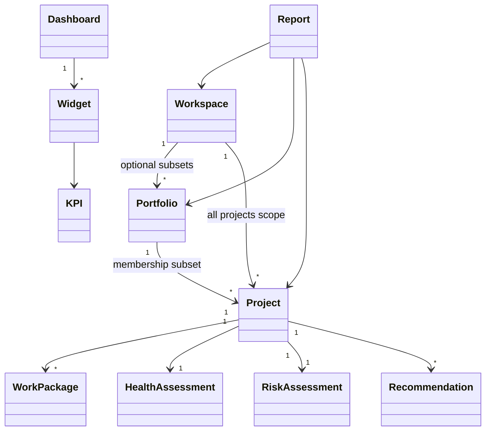

# Domain Model

Version: 1.0

Status: Draft

---

# 1. Purpose

This document defines the business domain of Project Analytics.

It establishes the entities, relationships, business rules, and ubiquitous language used throughout the application.

Every backend service, API, database table, and frontend model must be derived from the concepts defined in this document.

---

# 2. Domain Overview

Project Analytics models project performance rather than project execution.

Operational data is synchronized from OpenProject into local PostgreSQL and transformed into analytical information.

The domain focuses on:

- Workspaces (primary analytics scope)
- Portfolios (optional project subsets)
- Projects
- Analytics
- Health
- Risks
- Recommendations
- Reports
- Dashboards

OpenProject is the operational source of truth and is used only during synchronization. Dashboards and analytics operate exclusively on local synchronized data.

---

# 3. Ubiquitous Language

The following terms shall be used consistently throughout the project.

| Term | Description |
|------|-------------|
| Workspace | Exactly one connected OpenProject instance; primary analytics scope (“All Projects”) |
| Portfolio | Optional analytical collection of workspace projects (e.g. Finance, Employee Projects); many-to-many membership |
| Portfolio membership | Join of portfolio ↔ project; a project may appear in zero or more portfolios without changing ownership |
| Project | A synchronized OpenProject project stored locally |
| Work Package | A synchronized OpenProject work package stored locally |
| Dashboard | A collection of analytical widgets |
| Workspace Dashboard | Primary post-sync dashboard for all projects in a workspace |
| Portfolio Dashboard | Optional dashboard for a user-defined project subset |
| Widget | Reusable visualization component |
| KPI | Business performance indicator |
| Health Score | Overall project health indicator |
| Risk Score | Project risk indicator |
| Attention Score | Priority indicator for executive action |
| Recommendation | Suggested business action |
| Alert | Important business event |
| Report | Generated business document |
| Insight | AI-generated explanation based on analytics |

---

# 4. Core Domain

The core domain of Project Analytics is Decision Intelligence.

It transforms synchronized operational data into business intelligence.

Core capabilities include:

- Workspace Analysis (primary)
- Portfolio Analysis (optional subsets)
- Project Analysis
- KPI Calculation
- Recommendation Generation
- Executive Reporting

Primary user journey:

1. Connect Workspace (OpenProject instance)
2. Synchronize into local PostgreSQL
3. Use Workspace Dashboard and analytics immediately on local data

---

# 5. Domain Entities

## Workspace

Represents exactly one OpenProject instance connected to Project Analytics.

Attributes:

- id
- name
- baseUrl
- version
- synchronizationStatus
- createdAt
- updatedAt

Responsibilities:

- Store connection information
- Manage synchronization configuration
- Define the primary analytics boundary (“All Projects” for that instance)

---

## Portfolio

Represents an **optional** logical collection of projects within a workspace (organizational subset).

Attributes:

- id
- name
- description
- healthScore
- attentionScore
- totalProjects
- activeProjects

Responsibilities:

- Aggregate analytics for member projects only
- Support optional slicing (e.g. Finance, Strategic Initiatives)

Users are not required to create portfolios before analytics are useful. Projects are owned by the workspace; portfolios only reference them for analytical views. Primary UX remains the Workspace Dashboard.

---

## Project

Represents a synchronized project.

Attributes:

- id
- openProjectId
- name
- description
- status
- healthScore
- riskScore
- attentionScore
- budget
- progress
- startDate
- endDate

Responsibilities:

- Store synchronized project information
- Provide analytical metrics

---

## Work Package

Represents a synchronized work package.

Attributes:

- id
- openProjectId
- subject
- type
- status
- priority
- assignee
- estimatedHours
- spentHours
- dueDate

Responsibilities:

- Represent project tasks
- Supply analytics input

---

## User

Represents a platform user.

Attributes:

- id
- username
- email
- role
- preferences

Responsibilities:

- Authentication
- Authorization
- Personalization

---

## Dashboard

Represents an analytical dashboard.

Attributes:

- id
- name
- type
- owner
- layout

Responsibilities:

- Organize widgets
- Present business information

---

## Widget

Represents a reusable dashboard component.

Attributes:

- id
- type
- title
- configuration
- position

Responsibilities:

- Display analytical information

---

## KPI

Represents a measurable business indicator.

Attributes:

- id
- name
- value
- unit
- trend
- timestamp

Responsibilities:

- Measure business performance

---

## Health Assessment

Represents the calculated health of a project.

Attributes:

- score
- status
- explanation

Responsibilities:

- Evaluate project condition
- Explain score

---

## Risk Assessment

Represents project risk.

Attributes:

- score
- level
- explanation

Responsibilities:

- Detect project risks
- Support recommendations

---

## Recommendation

Represents an automatically generated business recommendation.

Attributes:

- id
- title
- description
- severity
- generatedAt

Responsibilities:

- Guide decision makers

---

## Alert

Represents an important business event.

Examples:

- Budget exceeded
- Milestone delayed
- Critical risk detected
- Synchronization failed

---

## Report

Represents a generated report.

Attributes:

- id
- title
- type
- generatedAt
- generatedBy

Responsibilities:

- Export business information

---

# 6. Value Objects

The following concepts are immutable.

- Health Score
- Risk Score
- Attention Score
- Money
- Date Range
- Percentage
- KPI Value

Value Objects contain no identity.

---

# 7. Domain Relationships

Workspace
contains
Portfolios (optional organizational subsets)

Workspace
scopes
All synchronized Projects (primary analytics set)

Portfolio
contains
a subset of Projects (optional membership)

Project
contains
Work Packages

Project
owns
Health Assessment

Project
owns
Risk Assessment

Project
produces
Recommendations

Dashboard
contains
Widgets

Widget
displays
KPIs

Report
summarizes
Workspace, Portfolio, or Project information

---

# 8. Domain Events

The following events may occur.

- ProjectSynchronized
- PortfolioUpdated
- HealthScoreCalculated
- RiskScoreCalculated
- AttentionScoreCalculated
- RecommendationGenerated
- AlertCreated
- ReportGenerated
- SynchronizationCompleted

Events represent completed business actions.

---

# 9. Business Rules

- One Workspace maps to exactly one OpenProject instance.
- Every Project belongs to exactly one Workspace.
- Every Project belongs to exactly one **Workspace** (ownership from synchronization).
- A Project may belong to **zero or more Portfolios** (organizational membership via portfolio_project).
- Portfolio membership is **purely organizational**: it does not change ownership, synchronization, or how scores are **calculated**.
- Membership only determines which projects are **included** in portfolio-scoped dashboards, recommendations, and reports.
- Portfolios are optional for the user experience; workspace analytics do not require portfolio creation.
- Portfolio membership is manual (add/remove); dynamic rule-based membership is out of scope for now.
- Every Dashboard contains one or more Widgets.
- Every Widget displays a single business capability.
- Every Recommendation must reference measurable data.
- Every KPI must be explainable.
- Every Report is generated from synchronized local data.
- Health Score must always be recalculated after synchronization.
- Analytics must never modify operational project data.
- Analytics and dashboards must never call OpenProject directly.

---

# 10. Mermaid Class Diagram

---

# 11. AI Implementation Notes

When implementing the domain:

- Preserve entity responsibilities.
- Avoid anemic domain models.
- Use value objects where appropriate.
- Keep business rules inside the domain layer.
- Do not expose persistence concerns in domain classes.
- Do not duplicate business logic across modules.
- Every entity should correspond to a clearly defined business concept.

---

# End of Document