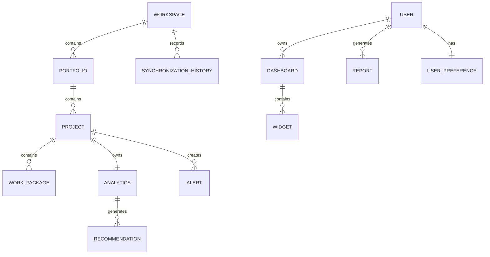

# Database Design

Version: 1.0

Status: Draft

---

# 1. Purpose

This document defines the relational database architecture of Project Analytics.

The database stores synchronized operational data, calculated analytics, user preferences, reports, and application configuration.

PostgreSQL is the primary persistence engine.

Redis is used only as a cache and is not considered part of the persistent data model.

---

# 2. Design Principles

The database shall follow these principles:

- Third Normal Form (3NF)
- Referential integrity
- Strong typing
- Auditability
- Scalability
- Performance
- Maintainability

Business rules must remain in the application layer rather than being embedded in database procedures whenever possible.

---

# 3. Naming Conventions

## Tables

Use lowercase snake_case.

Examples:

- workspace
- portfolio
- project
- work_package
- recommendation

---

## Columns

Use lowercase snake_case.

Examples:

- project_id
- health_score
- created_at
- updated_at

---

## Primary Keys

Every table contains:

id UUID PRIMARY KEY

UUIDs are generated by the backend.

---

## Foreign Keys

Foreign keys use:

<entity>_id

Example:

portfolio_id

---

## Timestamps

Every persistent table contains:

- created_at
- updated_at

Whenever appropriate:

- synchronized_at
- deleted_at (soft delete)

---

# 4. Database Schema Overview

Main entities:

Workspace

↓

Portfolio

↓

Project

↓

Work Package

↓

Analytics

↓

Recommendation

↓

Alert

↓

Dashboard

↓

Widget

↓

Report

↓

User

---

# 5. Tables

## workspace

Stores connected OpenProject instances.

Columns:

- id
- name
- base_url
- version
- synchronization_status
- created_at
- updated_at

---

## portfolio

Stores logical project collections.

Columns:

- id
- workspace_id
- name
- description
- health_score
- attention_score
- created_at
- updated_at

---

## project

Stores synchronized projects.

Columns:

- id
- portfolio_id
- openproject_id
- name
- description
- status
- budget
- progress
- start_date
- end_date
- synchronized_at
- created_at
- updated_at

---

## work_package

Stores synchronized work packages.

Columns:

- id
- project_id
- openproject_id
- subject
- type
- status
- priority
- assignee
- estimated_hours
- spent_hours
- due_date
- synchronized_at

---

## analytics

Stores calculated analytics.

Columns:

- id
- project_id
- health_score
- risk_score
- attention_score
- completion_percentage
- budget_variance
- schedule_variance
- calculated_at

---

## recommendation

Stores generated recommendations.

Columns:

- id
- analytics_id
- title
- description
- severity
- explanation
- generated_at

---

## alert

Stores business alerts.

Columns:

- id
- project_id
- type
- severity
- message
- acknowledged
- created_at

---

## dashboard

Stores dashboard definitions.

Columns:

- id
- user_id
- name
- dashboard_type
- layout

---

## widget

Stores dashboard widgets.

Columns:

- id
- dashboard_id
- widget_type
- title
- configuration
- position

---

## report

Stores generated reports.

Columns:

- id
- generated_by
- report_type
- file_path
- generated_at

---

## user

Stores authenticated users.

Columns:

- id
- username
- email
- password_hash
- role
- enabled
- created_at

---

## user_preference

Stores UI preferences.

Columns:

- id
- user_id
- theme
- language
- dashboard_configuration

---

## synchronization_history

Stores synchronization executions.

Columns:

- id
- workspace_id
- started_at
- finished_at
- duration
- status
- synchronized_projects
- synchronized_work_packages
- error_message

---

# 6. Relationships

Workspace

1 → N Portfolio

Portfolio

1 → N Project

Project

1 → N Work Package

Project

1 → 1 Analytics

Analytics

1 → N Recommendation

Project

1 → N Alert

User

1 → N Dashboard

Dashboard

1 → N Widget

User

1 → N Report

User

1 → 1 User Preference

Workspace

1 → N Synchronization History

---

# 7. Indexing Strategy

Indexes should be created for:

Primary Keys

Foreign Keys

Frequently filtered columns

Frequently sorted columns

Examples:

project(status)

project(start_date)

analytics(health_score)

work_package(project_id)

recommendation(severity)

alert(project_id)

---

# 8. Constraints

Examples:

Project name NOT NULL

User email UNIQUE

Workspace URL UNIQUE

Recommendation references valid Analytics

Dashboard belongs to existing User

Widget belongs to existing Dashboard

---

# 9. Soft Deletes

Soft deletes are preferred where historical data is valuable.

Entities supporting soft delete include:

- Reports
- Dashboards
- Widgets

Operational data synchronized from OpenProject should generally not be soft-deleted independently; instead, synchronization should reflect the current state of the source system according to the synchronization policy.

---

# 10. Audit Strategy

Important tables include:

created_at

updated_at

Optional:

created_by

updated_by

Synchronization history provides operational audit information.

---

# 11. Database Transactions

Transactions should be used for:

- Synchronization
- Recommendation Generation
- Report Creation
- Dashboard Updates

Transactions should remain short.

---

# 12. Performance

Performance techniques include:

- Proper indexing
- Pagination
- Lazy loading
- Query optimization
- Batch inserts during synchronization

Avoid N+1 queries.

---

# 13. Future Extensions

The schema is designed to support:

- Multiple OpenProject workspaces
- Multi-tenancy
- AI-generated insights
- Historical KPI snapshots
- Predictive analytics
- Event sourcing (future)

---

# 14. Mermaid ER Diagram

---

# 15. AI Implementation Notes

When implementing the database:

- Use UUID primary keys.
- Enforce referential integrity with foreign keys.
- Keep the schema normalized.
- Avoid business logic inside SQL.
- Add indexes only where justified by access patterns.
- Keep migrations idempotent and version-controlled.
- Prefer Flyway for schema migrations.

---

# End of Document